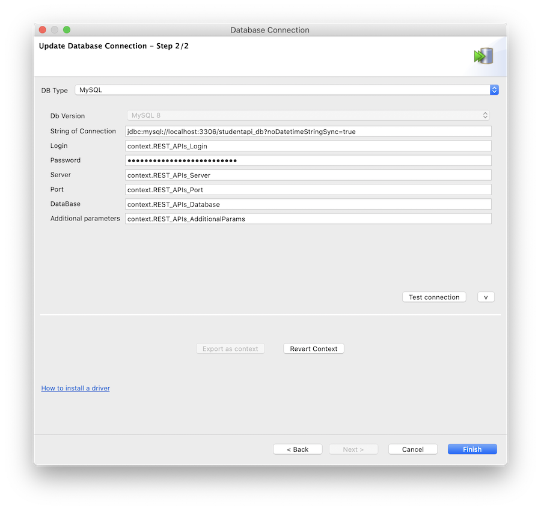

# Student API Demo (API001)

This guide will help you set up the Talend Student API Demo in your environment.

:warning: **Note**: You must have a [Talend Cloud](https://auth.us.cloud.talend.com/) account before proceeding. [Need Help?](#resources)

These instructions have been tested with Talend 7.3.1.

## Table of Contents

1. [Software Requirements](#softwarerequirements)
2. [Required Artifacts](#requiredartifacts)
3. [Setup](#setup)
   1. [Talend API Tester](#apitester)
   2. [Talend API Designer](#apidesigner)
   3. [Talend Studio](#studio)
4. [Demo](#demo)
5. [Resources](#resources)

## Software Requirements <a name="softwarerequirements"></a>

- [Google Chrome Browser](https://www.google.com/chrome/)
  - Chrome is required to run the Talend API Tester extension
- [Talend Cloud (Account)](https://auth.us.cloud.talend.com/) with access to:
  - Talend API Designer
  - Talend API Tester
  - Talend Management Console
- Talend Studio 7.3+
- A [MySQL 8](https://dev.mysql.com/downloads/) Instance

:question: Don't have a MySQL Instance? Consider running one in [Docker](../../../misc/docker.md)

## Required Artifacts <a name="requiredartifacts"></a>

These files will be imported during the set up below:

1. [API Tester Export](API001-StudentAPI_Tester_Export.json)
2. [API Designer Export](API001-StudentAPI_Designer_Export.json)
3. API001.zip (provided by the Channel team)

Additional materials for demo:
1. Demo Video (provided by the Channel team)
2. Demo Slides (provided by the Channel team)

## Setup <a name="setup"></a>

To begin the setup, navigate to [Talend Cloud](https://auth.us.cloud.talend.com/) and log in:


### Talend API Tester <a name="apitester"></a>

<details>
  <summary>Click to expand the instructions for this section</summary>
<br/>

Once logged in, choose __API Tester__ from the drop down menu:


This will launch a new tab with the Chrome Web Store. Install the extension by clicking __Add to Chrome__:


Confirm the installation of the extension by clicking __Add extension__:


The extension will now be added to Chrome:


Close the Chrome Web Store tab.

In Talend Cloud, choose __API Tester__ from the drop down menu:


In the Talend API Tester, choose __Import__ > __Import API Tester repository__ from the __Import__ menu on the bottom left:


Download [`API001-StudentAPI_Tester_Export.json`](API001-StudentAPI_Tester_Export.json) from this repository and locate it with __Choose a file...__:


Check all items to import and click __Import__:


The imported __Student API__ will appear in the repository on the left:


Close the Talend API Tester tab.

</details>

### Talend API Designer <a name="apidesigner"></a>

<details>
  <summary>Click to expand the instructions for this section</summary>
<br/>

In Talend Cloud, choose __API Designer__ from the drop down menu:


For new accounts, a window will appear to open or create an API. To create a new API, verify that __Empty API__ is selected on the bottom left of the window. Enter `Student API` on the bottom right of the window for this demo, and click __Create__:


With the new Student API created, choose __API__ > __Import__ > __OAS 3.0__ from the drop down menu:


Import the API Designer Export by one of two methods: From file *OR* From URL

#### From File

Download [`API001-StudentAPI_Designer_Export.json`](API001-StudentAPI_Designer_Export.json) from this repository and locate it with __Choose a file__:


#### From URL

Select __From URL__ and use the URL from this repository for `API001-StudentAPI_Designer_Export.json`: 

```
https://raw.githubusercontent.com/Talend/partnerresources/master/demos/api/api001-student-api/API001-StudentAPI_Designer_Export.json
```


Click __Import__ on the definition and verify that import was successful:


</details>

### Talend Studio <a name="studio"></a>

<details>
  <summary>Click to expand the instructions for this section</summary>
<br/>

For help downloading and installing Talend Studio, see the [documentation](https://help.talend.com/reader/vRlROgSYpuvOAlfTFHVLBg/O3u91jkHBRioKLLRO0QMrQ). After [launching](https://help.talend.com/reader/vRlROgSYpuvOAlfTFHVLBg/1dVpykJi_RA0jA66OIaQtw) Talend Studio, [connect to Talend Cloud](https://help.talend.com/reader/vRlROgSYpuvOAlfTFHVLBg/rBl3OC0I3ZqTg5M4sWMnUw).

#### Import Artifacts

Import `API001.zip` (obtained from the Channel team) into the Talend Studio repository by right clicking on __Job Designs__ and clicking __Import items__:


Choose __Select archive file:__ and browse to the `API001.zip` archive:


Import all items by clicking __Select All__ on the right and click __Finish__:


#### Create API Definition

Navigate to __Metadata__ > __REST API Definitions__ > __Create API Definition__ in the Talend Studio repository:


Choose the __Student API__ definition from the list of available definitions and click __Next__:


Click __Finish__:


The imported API definition will appear in the repository:


#### Update Database Contexts

Navigate to __Contexts__, right click on __REST_APIs_Database 0.1__, and click __Edit context group__:


Click __Next__:


Update the values to connect to your MySQL instance and click __Finish__:


If prompted to propagate to all jobs, click __Yes__:


Confirm all items are checked and click __OK__:


#### Test Database Connection

Navigate to __Metadata__ > __Db Connections__, right click on __REST_APIs 0.1__, and click __Edit connection__:


Click __Next__:


Towards the middle of the screen, click __Test connection__:



If prompted to download third party modules, click __Download and install all modules available__:


If the connection is successful, a message will appear:


Click __OK__ to dismiss the message, click __Finish__ and click __Yes__ to confirm propagation (no updates should be required):


#### Generate Data

In the repository, navigate to __Job Designs__ > __Standard__ > __API__ > __Student_API__ and open the __x_SETUP_Generate_Data 0.1__ job:


Select the __Run job__ tab and click __Run__ to run the job:


The job should generate and load 300 rows into a `student_api` table in the MySQL instance:


#### Test Student API

In the repository, navigate to __Job Designs__ > __Standard__ > __API__ > __Student_API__ and open the __Student_API 0.1__ job:


Select the __Run job__ tab and click __Run__ to run the job:


After validating no errors, __Kill__ the job:


</details>

## Demo <a name="demo"></a>

Please refer to the video provided by the Channel team to review the demo flow and receive demo slides.

## Resources <a name="resources"></a>

Please contact your Talend Channel team for support with this demo.

### Other Resources

- General
  - [Video: Talend Studio Improvements for API Services \[3:16\]](https://www.youtube.com/watch?v=8Feot1mXlr0)
  - [Video: Talend API Services Publish to Talend Cloud \[3:09\]](https://www.youtube.com/watch?v=gNDqA30knyY)

- API Designer
  - [Video: Talend API Designer – Technical Overview \[3:46\]](https://www.youtube.com/watch?v=_zfjPtYyD68)

- API Tester
  - [Video: Talend API Tester: Technical Overview \[3:04\]](https://www.youtube.com/watch?v=CnESGGPqycs)
  - [Video: Talend API Tester – Working with Scenarios \[3:14\]](https://www.youtube.com/watch?v=slG8DXSTWGU)
  - [Documentation: Introduction to Talend Cloud API Tester](https://help.talend.com/reader/HujBrzfhc9BvOeZxdRW3_A/mMOC378B7IyS3yyrlqQgGw)
  - [Product Page: Cloud API Tester](https://www.talend.com/products/application-integration/cloud-api-tester/)
