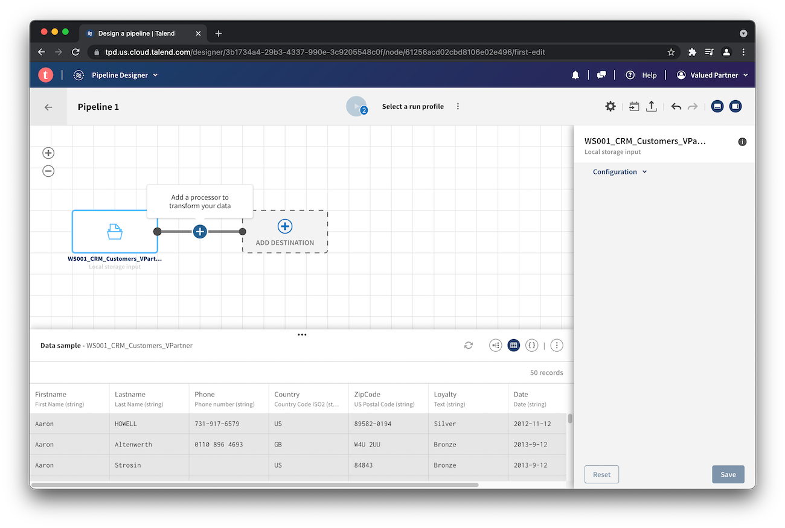
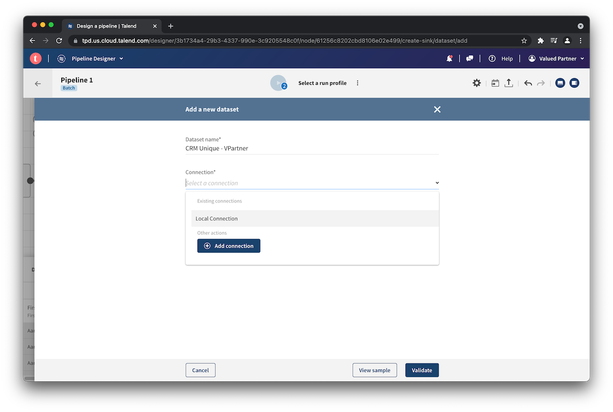
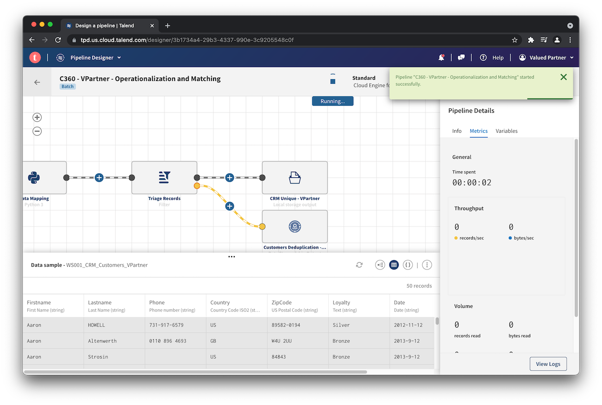

# Workshop (WS001)

This guide will help you to set up your environment and walk through aspects of the workshop.

## Table of Contents

1. [Software Requirements](#softwarerequirements)
2. [Required Artifacts](#requiredartifacts)
3. [Setup](#setup)
   1. [Talend Cloud](#tc)
   2. [Talend Data Inventory](#tdi)
   3. [Talend Data Stewardship](#tds)
   4. [Talend Pipeline Designer](#tpd)
   5. [Results](#results)
4. [Resources](#resources)

## Software Requirements <a name="softwarerequirements"></a>

- [Google Chrome Browser](https://www.google.com/chrome/) or a [supported browser](https://help.talend.com/r/ZBKKZVJBkDd7ahlDL~Sd5A/dwsHUf_92boPg8TSwgAwQQ)
- [Talend Cloud (Account)](https://auth.us.cloud.talend.com/) with access to:
  - Talend Data Inventory
  - Talend Data Preparation
  - Talend Data Stewardship
  - Talend Pipeline Designer
  - Talend API Designer

## Required Artifacts <a name="requiredartifacts"></a>

The files below are used to set up the environment. For purposes of the workshop, you will only need `WS001_CRM_Customers.csv`:

1. [WS001_API_Contract.json](https://raw.githubusercontent.com/Talend-PreSales/partnerresources/master/workshops/ws001/WS001_API_Contract.json)
2. [WS001_CRM_Customers.csv](https://raw.githubusercontent.com/Talend-PreSales/partnerresources/master/workshops/ws001/WS001_CRM_Customers.csv)
3. [WS001_Data_Model.json](https://raw.githubusercontent.com/Talend-PreSales/partnerresources/master/workshops/ws001/WS001_Data_Model.json)
4. [WS001_HouseholdComposition_SemanticType.json](https://raw.githubusercontent.com/Talend-PreSales/partnerresources/master/workshops/ws001/WS001_HouseholdComposition_SemanticType.json)
5. [WS001_Stewardship_Campaign.json](https://raw.githubusercontent.com/Talend-PreSales/partnerresources/master/workshops/ws001/WS001_Stewardship_Campaign.json)

:information_source:&nbsp; To save a file, right click on the link and __Save Link As__

:warning:&nbsp; Verify the file extension after downloading and rename as needed

## Setup <a name="setup"></a>

### Talend Cloud <a name="tc"></a>

You will receive an e-mail invitation to activate your account. Follow the __Accept Invitation__ link:


Complete your profile by setting a password and clicking __Save__:


:warning:&nbsp; Stop here | Do not proceed until instructed :warning:

### Talend Data Inventory <a name="tdi"></a>

Locate the file `WS001_CRM_Customers.csv` on your machine and rename it with your name appended. For example, if your first name is _Valued_, and your last name is _Partner_, rename the file to `WS001_CRM_Customers_VPartner.csv`.

If not already logged in, navigate to [Talend Cloud](https://login.us.cloud.talend.com/) and log in:


If it is your first time logging in, you may see a welcome landing page:


Scroll to the bottom of the page to the __Bring it all together__ section and click the __Discover__ button:


From the app selector on the top left corner, choose __Data Inventory__:


If presented with a __Welcome to Data Inventory__ dialog box, click __X__:


Take the renamed `WS001_CRM_Customers_*.csv` file and drop it onto the page or click __browse__ to select it:


If presented with a __Welcome to the dataset overview__ dialog box, click __X__:


While the file is being analyzed, parts of the dataset overview may be unavailable:


After the file is analyzed, information in the dataset overview will appear:


### Talend Data Stewardship <a named="tds"></a>

From the app selector on the top left corner, choose __Data Stewardship__:


If presented with a __Welcome to Talend Data Stewardship__ dialog box, click __Skip__:


Click __Campaigns__ on the left menu and click __+ Add Campaign__ towards the top left of the page:


#### General

For the campaign name, enter `Customers Deduplication - VPartner` where `VPartner` is your first initial and last name:


From the __Type__ drop down, select `Merging`:


#### Data Model

For the data model, select `Customer DH`:


After selecting the data model, set the following surivorship rules:

* Lastname: Most recent
* Phone: Most common
* Country: Most common
* Zipcode: Most common
* Loyalty: Most recent
* House Description: Most recent
* Date: Most recent


#### Workflow

For the __New__ and __Resolved__ workflow steps, choose the `Stewards` role:


The new campaign will be created:


### Talend Pipeline Designer <a name="tpd"></a>

From the app selector on the top left corner, choose __Pipeline Designer__:


If presented with a __Welcome to Talend Pipeline Designer__ dialog box, click __X__:


Towards the top left of the page, click __Add Pipeline__:


If presented with a __Canvas__ dialog box, click __X__:


#### Source

In the canvas, click on the __+ Add Source__ to add a source. From the __Select a source__ dialog box, choose the file that was uploaded:


Click __Select__ on the bottom right of the dialog box.

With the source added, notice the data preview at the bottom of the screen:


#### Aggregate Processor

Next, add a processor by clicking the __+__ between the source and Destination:



Under __Schema manipulation__, choose __Aggregate__:


In the configuration panel on the right of the page, add two fields for __Group by__; first, `.Lastname`, then `.Firstname`:


Under __Operations__ add these six fields in the following order:

```
.Phone
.Country
.ZipCode
.Loyalty
.Date
.HouseholdDescription
```
Choose `List` for operation:


Rename this processor to `Aggregate by Name` and click Save.


With the aggregate processor added, notice the data preview at the bottom of the screen:


#### Python Processor

Next, add a processor by clicking the __+__ between the Aggregate processor and Destination:


Under __Custom code__, choose __Python 3__:


Copy and paste the code from [`ws001_transform.py`](ws001_transform.py) into the processor configuration. Rename the processor to `Data Mapping` and click __Save__. Notice the data preview at the bottom of the screen:


#### Filter Processor

Next, add a processor by clicking the __+__ between the Python processor and Destination:


Under __Routing__, choose __Filter__:


In the configuration panel on the right of the page, add the field `.IS_DUPLICATE` to the __Input__ and a value of `false` for __Value__:


Rename this processor to `Triage Records` and click Save.


With the filter processor added, notice the data preview at the bottom of the screen.

Find the yellow dot to the right of the Filter processor and click the __+__:


Two destinations will now be available from the Filter processor:


#### Destination (Output)

Click on the *top* __+ Add Destionation__ to add a destionation. From the __Select a destination__ dialog box, click __+ Add dataset__:


For the __Dataset name__, enter `CRM Unique - VPartner` where `VPartner` is your first initial and last name. For __Connection__, choose `Local Connection`:



For the __Format__, choose `CSV`:


Toggle the __Set header__ option to on:


Click __Validate__ at the bottom of the page. The dataset will be created and configuration will be saved:


#### Destination (Stewardship)

Click on the *bottom* __+ Add Destionation__ to add a destionation. In the __Select a destination__ dialog box, choose __Campaigns__ at the top:


Choose the campaign that was created earlier in [Talend Data Stewardship](#tds).


In the configuration panel on the right of the page, set __State__ to `New` and click __Save__.


#### Run Pipeline

Rename the pipeline to `C360 - VPartner - Operationalization and Matching` where `VPartner` is your first initial and last name:


Towards the middle top of the page, click on __Select a run profile__ and choose `Standard` in the dialog box:


Click on the play icon to run the pipeline:



Verify the job completed without errors:


### Results <a name="results"></a>

Navigate to [Data Stewardship](https://tds.us.cloud.talend.com/#/mycampaigns) and confirm that there are unassigned records in the campaign.

Navigate to [Data Inventory](https://tdc.us.cloud.talend.com/datasets) and confirm that the output dataset has been created.

## Resources <a name="resources"></a>

### How does the Python processor work?

The incoming record is available as the `input` variable. By default, JSON and collections are automatically imported and `output = input`.